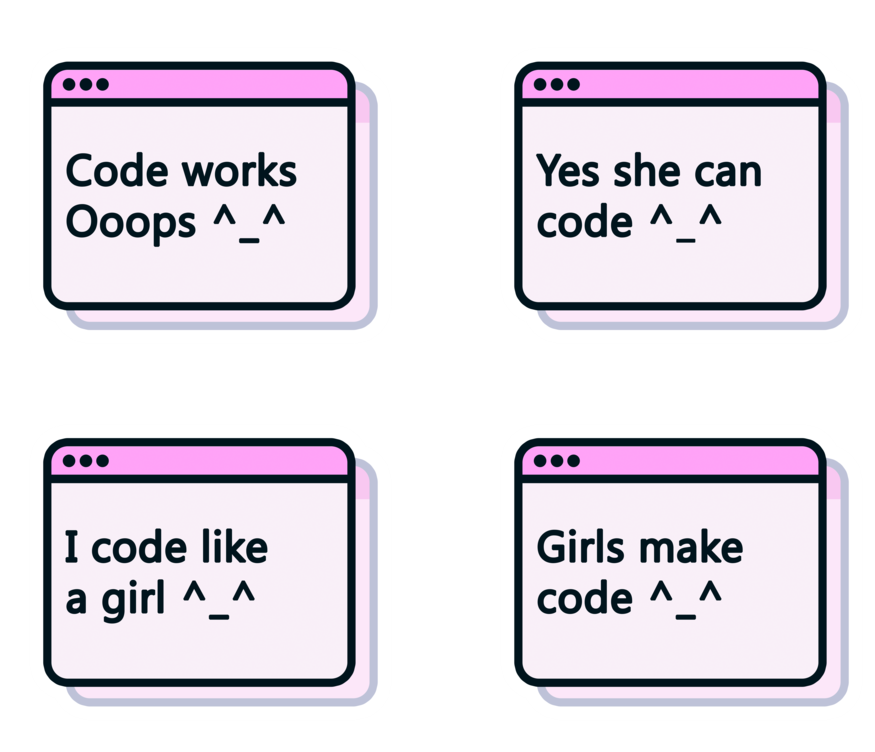

 

###

<h1 align="center">Hey techies 👋</h1>

###

  
  
  

###

<h3 align="left">👩‍💻  About Me</h3>

###

👋 Hi, I'm Kritika! 🎓🚀  💻 3rd-year B.Tech student 🌐 Passionate about technology and innovation 📚💻 Currently exploring academia and coding 🌟 Loves a good challenge and embraces new opportunities ☕🚀 Tech journey fueled by curiosity, code, and coffee 📊💡 Enjoys diving into algorithms and learning new languages ✨ Excited about projects in the ever-evolving tech landscape 🚀📊 Keen on exploring domains like software development and data science

###
 

  

###

<h3 align="left">🎉 Visitors Count!! 🎊👥✨</h3>

###

  

###

  

###

<h5 align="left">🌟 Thanks for stopping by!! 🌈✨ Your visit is truly appreciated! 🙌💖</h5>

###

<h3 align="left">🛠 Language and tools</h3>

###

  
  
  
  
  
  
  
  
  
  
  
  
  
  
  
  
  
  
  
  
  
  
  
  
  
  
  
  
  
  
  
  
  
  
  
  
  
  
  
  
  
  
  
  
  

###

<h3 align="left">🔥   My Stats :</h3>

###

  
  

###

###

  

###

  
  
  
  

###
